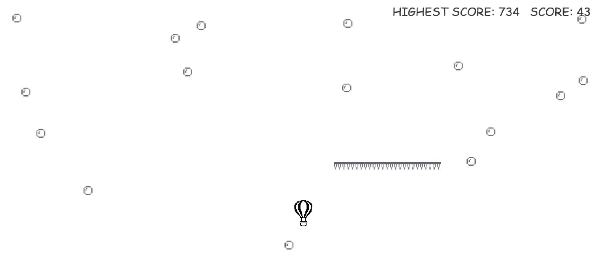

## About this game
I am Farhan Parwez Khan and I have made this game called Hot Air Balloon Game which is actually the offline game shown on Google Play Store. It is made by using Python programming language. The rules are simple the score gets increasing with time and bonus when you collect those bubbles and if you hit the obstacle you lose try to make as much score as you can. Enjoy it!
### Code behind the game:

### The game:

